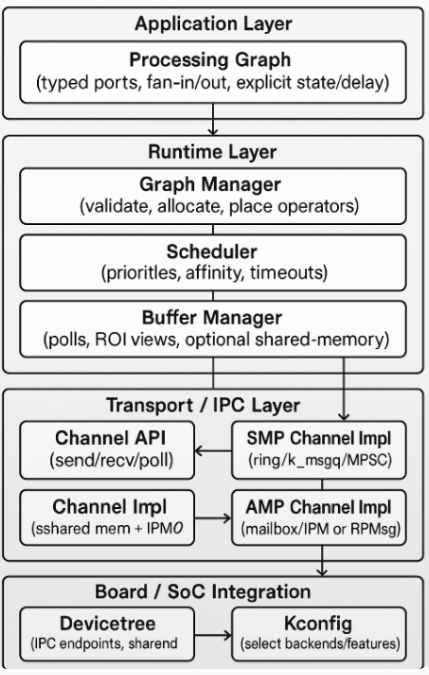
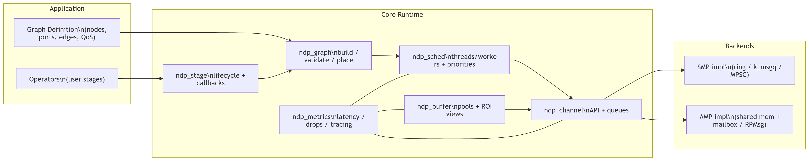
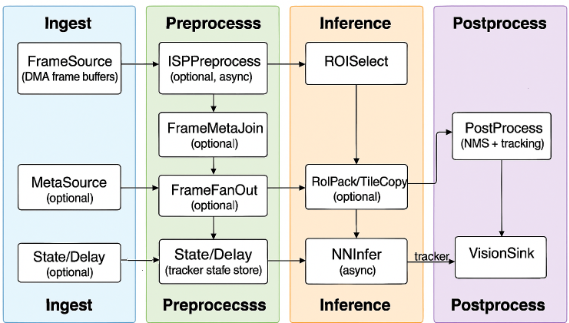
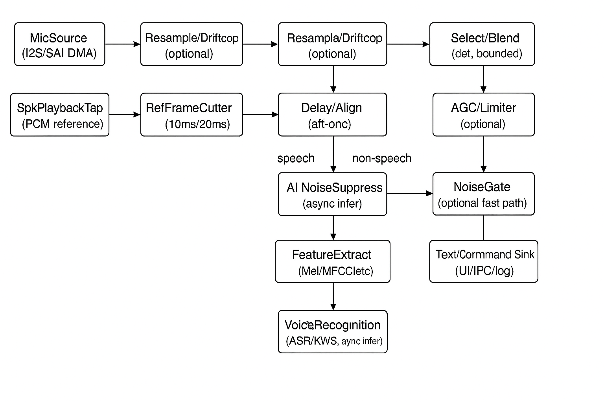

# Zephyr NDP (Near-Real-Time Data Processing) Framework — Architecture Design

> Goal: a near-real-time *data processing pipeline framework* for Zephyr RTOS that runs unchanged on **SMP** (single Zephyr image across multiple cores) and **AMP** (multiple images / heterogeneous cores), by isolating execution + transport behind stable runtime interfaces.

## 1. Scope and Non-Goals

### In scope
- Low-latency, bounded-memory **stream processing pipelines**: ingest → transform → emit.
- A **stage graph** (DAG) runtime with deterministic buffering and backpressure/drop policies.
- **SMP backend**: intra-image queues + Zephyr threading/workqueues.
- **AMP backend**: inter-image edges via IPC (shared memory + mailbox/IPM/RPMsg/OpenAMP depending on target).
- A single application model and API regardless of SMP/AMP.

### Non-goals
- General-purpose POSIX “process” isolation.
- Unbounded dynamic allocation in hot paths.
- Implicit distributed scheduling across AMP domains without explicit partitioning.

## 2. Design Principles

- **Determinism first**: fixed-size buffers, bounded queues, explicit overload behavior.
- **Separation of concerns**: application pipeline definition vs runtime scheduling vs transport.
- **Pluggable transport**: local (SMP) and remote (AMP) channels share one API.
- **Observability**: timestamps, queue depth, drops, CPU utilization.
- **Safety**: avoid deadlocks; timeouts and health checks for remote edges.

## 3. Architecture Overview

### Architecture diagram



```mermaid
flowchart TB
  subgraph APP[Application Layer]
    G[Processing Graph\n(typed ports, fan-in/out, explicit state/delay)]
  end

  subgraph RT[Runtime Layer]
    GM[Graph Manager\n(validate, allocate, place operators)]
    SCH[Scheduler\n(priorities, affinity, timeouts)]
    BM[Buffer Manager\n(pools, ROI views, optional shared-memory)]
    MET[Metrics/Tracing\n(latency, drops, queue depth)]
  end

  subgraph TR[Transport / IPC Layer]
    CH[Channel API\n(send/recv/poll)]
    SMP[SMP Channel Impl\n(ring/k_msgq/MPSC)]
    AMP[AMP Channel Impl\n(shared mem + mailbox/IPM or RPMsg)]
  end

  subgraph BSP[Board / SoC Integration]
    DT[Devicetree\n(IPC endpoints, shared memory)]
    KC[Kconfig\n(select backends/features)]
  end

  G --> GM
  G --> SCH
  GM --> BM
  SCH --> CH
  BM --> CH
  CH --> SMP
  CH --> AMP
  SMP --> DT
  AMP --> DT
  DT --> KC
  MET --- SCH
  MET --- CH
```

### Layered view

1. **Application Layer**
  - Defines a **processing graph** of operators with typed input/output ports.
  - Supports fan-out, fan-in (merge/join), side outputs, and (when needed) feedback via explicit delay/state operators.
  - Configures QoS: queue depths, drop policy, deadlines, priorities.

2. **Runtime Layer**
   - Graph manager: validates DAG, allocates queues/buffers, assigns stage execution.
   - Scheduler: maps stages to threads/workers, assigns priorities/affinity.
   - Buffer manager: memory pools and (optional) shared-memory-backed payload buffers.
   - Metrics/tracing: end-to-end latency, stage runtimes, drops.

3. **Transport/IPC Layer (pluggable)**
   - **Channel** abstraction: `send/recv/poll` regardless of local/remote.
   - Implementations:
     - SMP: lock-free ring, message queue, or MPSC queue.
     - AMP: shared memory + mailbox/IPM notify, or RPMsg/OpenAMP.

4. **Board Integration**
   - DeviceTree describes IPC devices + shared memory region.
   - Kconfig selects the transport backend.

### Component diagram (logical)



The runtime is split into small modules so that SMP vs AMP differences are isolated to transport/buffer details.

```mermaid
flowchart LR
  subgraph APP[Application]
    OP[Operators\n(user stages)]
    GD[Graph Definition\n(nodes, ports, edges, QoS)]
  end

  subgraph CORE[Core Runtime]
    G[ndp_graph\nbuild/validate/place]
    S[ndp_stage\nlifecycle + callbacks]
    SCH[ndp_sched\nthreads/workers + priorities]
    CH[ndp_channel\nAPI + queues]
    B[ndp_buffer\npools + ROI views]
    M[ndp_metrics\nlatency/drops/tracing]
  end

  subgraph BACK[Backends]
    SMP[SMP impl\n(ring/k_msgq/MPSC)]
    AMP[AMP impl\n(shared mem + mailbox/RPMsg)]
  end

  OP --> S
  GD --> G
  S --> G
  G --> SCH
  SCH --> CH
  B --> CH
  CH --> SMP
  CH --> AMP
  M --- SCH
  M --- CH
  M --- B
```


#### Module responsibilities and key interfaces

- `ndp_graph` — graph build/validate/place
  - Responsibilities:
    - validate port typing and edge QoS (depth, drop policy, timeouts)
    - assign operator instances to execution contexts (threads/worker pools; domain placement for AMP)
    - create the concrete channel instances (local vs remote) per edge
  - Key interfaces (conceptual):
    - `ndp_graph_build()` / `ndp_graph_validate()` / `ndp_graph_start()` / `ndp_graph_stop()`

- `ndp_stage` — operator interface and lifecycle
  - Responsibilities:
    - define operator callbacks (`init/start/process/stop/deinit`)
    - provide a consistent async pattern for hardware operators (enqueue → completion → emit)
  - Key interfaces (conceptual):
    - `ndp_stage_process()` (sync) and/or `ndp_stage_submit()` + completion hook (async)

- `ndp_sched` — execution policy
  - Responsibilities:
    - thread-per-operator vs worker-pool scheduling
    - priority/affinity assignment (RTOS-friendly)
    - bounded waits and timeouts for joins and backpressure
  - Key interfaces (conceptual):
    - `ndp_sched_register_stage()` / `ndp_sched_wake()`

- `ndp_channel` — unified channel API
  - Responsibilities:
    - implement `send/recv/poll` semantics consistently
    - enforce channel QoS deterministically (DROP_OLD/DROP_NEW/BLOCK with timeout)
    - support fan-out by allowing multiple consumers or explicit duplicator operators
  - Key interfaces (conceptual):
    - `ndp_channel_send()` / `ndp_channel_recv()` / optional `ndp_channel_poll()`

- `ndp_buffer` — payload memory and ROI views
  - Responsibilities:
    - fixed-size pool allocation for envelopes and payload blocks
    - represent full-frame payloads and ROI “views” (metadata-only)
    - optional shared-memory pools for AMP; offsets/handles instead of pointers
    - describe DMA-relevant layout (planes, optional segments)
  - Key interfaces (conceptual):
    - `ndp_buf_alloc()` / `ndp_buf_free()` / `ndp_buf_view_roi()`

- `ndp_metrics` — observability
  - Responsibilities:
    - timestamping and latency accounting across operators
    - drop counters, queue depth high-water marks
    - optional tracing hooks (kept off critical path)
  - Key interfaces (conceptual):
    - `ndp_metrics_stamp()` / `ndp_metrics_drop_inc()`

Backends:
- SMP backend plugs into `ndp_channel` with local queues and wakeups.
- AMP backend plugs into `ndp_channel` with shared-memory payload handles + IPC notifications.

- `ndp_graph` — stage DAG build/validate
- `ndp_stage` — stage interface and lifecycle
- `ndp_sched` — execution policy (thread-per-stage, worker pool, priorities)
- `ndp_channel` — unified channel API
- `ndp_buffer` — slab/pool payload allocation, optional shared-memory pools
- `ndp_metrics` — tracing/telemetry hooks

## 4. Core Concepts

### 4.1 Stage
A stage is the basic processing unit.

**Stage types**

The framework uses a **dataflow operator** model rather than a strict “source/sink pipeline”.

- **Producer operator**: produces messages (timer-driven, interrupt-driven, device-driven).
- **Compute operator**: consumes one or more inputs, transforms/joins, emits one or more outputs.
- **Consumer operator**: consumes messages and causes side effects (store/transmit/actuate/display).

Operators may have:
- multiple input ports (fan-in),
- multiple output ports (fan-out / side outputs),
- control/config ports (control plane),
- state (explicitly managed, see note below).

**Graph shape**
- Many NDP workloads are *not* a single line. They are branching/merging graphs and may be multi-rate.
- If feedback is required (e.g., tracker state feeding ROI selection), model it explicitly using a state/delay operator so the runtime can remain schedulable.

**Stage lifecycle**
- `init` → `start` → `run` (repeated) → `stop` → `deinit`

**Execution contract**
- Stages are expected to be **non-blocking** on long I/O in the hot path; if I/O is required, use asynchronous APIs or dedicate a stage/thread for it.
- Avoid heap allocation inside `process`.

For hardware-accelerated stages (ISP, DMA, NN accelerators), prefer an **async stage** pattern:
- enqueue work to the device/DMA engine,
- return quickly,
- emit output on completion callback/interrupt (or via a completion event that wakes the stage thread).

### 4.2 Message
Messages are fixed-shape envelopes that reference payloads.

**Envelope fields (recommended)**
- `type_id` / `schema_version`
- `timestamp_produced` (for end-to-end latency)
- `sequence` (detect drops)
- `payload_ref` (pointer/offset/handle depending on backend)
- optional `flags` (e.g., keyframe, partial, etc.)

**Correlation fields (recommended for fan-out/fan-in and tiling)**
- `stream_id` (which camera/stream)
- `frame_id` (monotonic per stream; used to join results)
- `roi_id` (optional; identifies an ROI within a frame)
- `tile_id` (optional; identifies a tile/ROI instance for parallel processing)
- `tile_count` (optional; expected number of tiles for the given `frame_id`/`roi_id`)

These fields enable deterministic joins (e.g., `TileMerge/Join`) without relying on timing heuristics.

**Image/vision payload metadata (recommended when processing frames)**
- `pixel_format` (e.g., RGB888, YUV420, GRAY8)
- `width`, `height`
- `stride_bytes` (or per-plane strides)
- `planes[]` (per-plane base offset/handle and size)
- `roi` (optional) describing the Region of Interest within the frame (see 4.5)

**Audio payload metadata (recommended when processing audio)**
- `sample_format` (e.g., S16LE, S24LE, S32LE, F32)
- `sample_rate_hz` (e.g., 16000, 48000)
- `channels` (e.g., 1 mono, 2 stereo, N mic array)
- `channel_layout` (optional; e.g., L/R or mic geometry id)
- `frame_samples` (samples per channel carried in this message)
- `interleaved` (bool; interleaved vs planar)
- `timestamp_start` / `timestamp_end` (or start + duration)

**AI inference metadata (optional)**
- `model_id` / `model_version`
- `tensor_format` (e.g., int8 quantized, fp16, fp32)
- `inference_deadline` (optional; helps scheduling/overload decisions)

**Voice recognition / speech results (optional)**
- `utterance_id` (optional; correlates partial/final results)
- `result_type` (e.g., `partial`, `final`, `keyword`, `command`)
- `text` (UTF-8 transcript or command label)
- `confidence` (0..1)
- `time_offset_ms` / `time_range_ms` (alignment back to audio frames)

### 4.3 Channel
A channel connects two stages (an edge). It is the only coupling between stages.

**QoS attributes (per channel)**
- `depth` (bounded)
- `policy`:
  - `DROP_NEW` (reject newest)
  - `DROP_OLD` (overwrite oldest)
  - `BLOCK` (only if bounded wait is acceptable)
- `timeout` (for blocking/poll waits)

### 4.4 Buffer pool
The framework uses slab/pool allocators for payloads.

- SMP: `k_mem_slab` / `sys_mem_blocks` / custom fixed block pool.
- AMP: shared-memory pool where payload blocks are addressed via **offsets** (not raw pointers).

For image processing, prefer payloads that can represent:
- a full-frame buffer (single allocation per frame), and
- a lightweight ROI “view” (metadata-only) that references the same underlying buffer.

This enables zero-copy ROI pipelines on SMP, and either zero-copy or copy-on-ROI on AMP depending on shared-memory capacity and cache/coherency constraints.

### 4.5 ROI (Region of Interest)
ROI enables image stages to operate on sub-regions of a frame without copying the full frame.

**ROI representation (suggested)**
- `roi.valid` (bool)
- `roi.x`, `roi.y` (top-left)
- `roi.w`, `roi.h` (size)
- optional: `roi.tile_id` / `roi.level` (for tiled or pyramid representations)

**Key rules**
- ROI is always defined in the coordinate space of the referenced image payload.
- Stages must treat ROI as *advisory but binding*: if `roi.valid==true`, the stage processes only that region (unless explicitly documented otherwise).

**Zero-copy ROI views**
- A ROI view does not change the underlying payload bytes; it changes only metadata.
- For planar formats (e.g., YUV420), ROI must respect chroma subsampling alignment (e.g., x/y even alignment) or the stage must round/clip safely.

**When to copy**
- If a downstream accelerator/DMA requires contiguous ROI buffers or strict alignment.
- If AMP shared memory cannot hold full frames reliably; copy and send only ROI tiles.

**AMP note**
- For AMP, ROI views must use offsets/handles (never raw pointers). The runtime must ensure cache maintenance / barriers for the ROI region when using cached shared memory.

**Camera/sensor-provided ROI metadata buffers**
Some camera sensors/ISPs can output ROI metadata as a **sideband buffer** (often via DMA) per frame, e.g. AF/AE/AWB stats windows, motion regions, face rectangles, or vendor-specific ROI proposals.

Recommended handling pattern:
- Treat the ROI metadata as its own payload type (e.g., `RoiMeta`) with its own pool (or shared-memory pool for AMP).
- Ingest it via a dedicated operator (e.g., `MetaSource`) that produces messages containing:
  - parsed ROI list/rectangles, and
  - correlation fields (`stream_id`, `frame_id` if available, else timestamp-based correlation).
- Merge it with frames using an explicit join operator (e.g., `FrameMetaJoin`) rather than hiding it inside `FrameSource`:
  - `FrameMetaJoin` consumes `ImageFrame` and `RoiMeta` streams and outputs `ImageFrame` with `roi` populated (or a `roi_list`).
  - Use bounded timeouts and deterministic behavior when metadata is missing/late (e.g., fall back to previous state or emit “no ROI”).

Correlation guidance (in order of preference):
1. Use sensor-provided `frame_id` / frame counter if present.
2. Else, use start-of-frame timestamp captured in ISR for both DMA completions, and match within a configured tolerance.
3. Else, treat metadata as asynchronous hints and feed it through `State/Delay` into `ROISelect`.

DMA/ownership guidance:
- If the ROI meta buffer is DMA-written, apply the same cache invalidation rules as image payloads after DMA completes.
- For AMP, avoid shipping raw vendor blobs across domains if you can parse them in the producer domain and send a compact, versioned ROI structure.

## 5. Execution Models

The same DAG is supported by multiple execution models.

### 5.1 SMP Execution (single Zephyr image)

**Option A: Thread-per-stage (recommended for strict latency control)**
- Each stage owns a `k_thread`.
- Stage thread blocks on input channel(s) via `k_poll` or waits on a semaphore.
- Priority directly models real-time requirements.

Pros:
- Clear scheduling, easy to reason about worst-case latency.

Cons:
- More threads; may be heavy for large DAGs.

**Option B: Worker pool (recommended for many small stages)**
- A fixed number of worker threads pulls ready stages from a run queue.
- Stages are run-to-completion per message.

Pros:
- Better CPU utilization, fewer threads.

Cons:
- Harder to guarantee per-stage latency; must carefully design ready-queue policy.

**SMP primitives**
- Transport: lockless ring buffer (`ring_buf`) or custom MPSC.
- Wakeups: `k_poll`, `k_sem`, `k_msgq`.
- Affinity: optional `k_thread_cpu_mask_enable` where supported.

### 5.2 AMP Execution (multiple images / domains)

**Partition the DAG into domains**
- A “domain” is a Zephyr image on a core (or cluster) that runs its own runtime.
- Channels can be local (intra-domain) or remote (inter-domain).

**Remote channels (data plane)**
- Payloads in shared memory; messages contain offsets/handles.
- Notifications via mailbox/IPM or RPMsg.

**Control plane**
- Start/stop, health, reconfiguration messages separate from data.
- The control plane can reuse the same IPC transport but different endpoints/queues.

**AMP fault handling**
- Remote edge has:
  - heartbeat / last-seen timestamp
  - timeout handling to avoid deadlocks
  - backpressure policy that doesn’t require remote cooperation (e.g., DROP_OLD)

## 6. Scheduling and Timing

### 6.1 Scheduling policy
- Baseline: fixed priorities.
- For periodic sources: rate-monotonic style mapping is common (shorter period ⇒ higher priority).
- For transforms: priorities typically inherit from upstream criticality.

### 6.2 Time model
- Use `k_cycle_get_32/64()` for high-resolution measurements.
- Convert to nanoseconds with `sys_clock_hw_cycles_per_sec()`.
- Timestamps should be stored in the envelope to measure per-stage and end-to-end latency.

### 6.3 Overload strategy
Every channel must declare a deterministic behavior under load:
- Drop new
- Drop old (overwrite)
- Block with bounded timeout

Avoid unbounded blocking unless the system is proven schedulable.

## 6A. RTOS/Zephyr Feature Considerations

This framework is intended to *use RTOS features explicitly* to achieve bounded latency and predictable behavior.

### 6A.1 Threading, priorities, and preemption
- Use Zephyr **preemptive threads** for latency-critical operators (e.g., DMA completion handling, ROI selection, join/merge).
- Assign priorities intentionally:
  - periodic/interrupt-driven producers highest,
  - operators on the critical path next,
  - best-effort sinks (telemetry/logging) lower.
- Prefer **static thread creation** (known stacks, known priorities) rather than dynamic thread spawning.
- For SMP builds, decide whether to:
  - allow free migration (default), or
  - pin critical threads to CPUs (where supported) to reduce jitter.

### 6A.2 Interrupts (ISR) and deferred work
- Keep ISRs short: capture timestamp/status, enqueue minimal event/handle, and defer work.
- Recommended ISR→thread handoff patterns:
  - `k_sem_give()` / `k_event_post()` to wake a dedicated stage thread, or
  - enqueue to a lockless ring and signal.
- Avoid doing heavy image copies, ROI computation, or join logic in ISR context.

### 6A.3 Timers and multi-rate pipelines
- For periodic sources, use `k_timer` or device-triggered interrupts.
- For multi-rate graphs, represent rate changes explicitly (e.g., `Downsample`, `FrameSkip`, `Batch`) instead of letting queues grow.
- For join operators, use bounded **timeouts** (e.g., `k_timeout_t`) to prevent indefinite waits for missing tiles.

### 6A.4 Synchronization and priority inversion
- Prefer message passing over shared mutable state.
- If shared state is required (e.g., `State/Delay`), keep it bounded and use short critical sections.
- If mutexes are needed, use Zephyr primitives that support **priority inheritance** (e.g., `k_mutex`) to reduce inversion risk.
- In SMP, use atomics/spinlocks appropriately for very short regions; avoid long-held locks.

### 6A.5 Memory management and protection
- Hot path memory should be pool-based (`k_mem_slab`, `sys_mem_blocks`, or custom fixed pools).
- Treat allocation failures as a normal overload condition: drop deterministically and increment metrics.
- Optional hardening (platform dependent):
  - use Zephyr **user mode** + memory domains to constrain untrusted stages,
  - isolate shared memory regions used for AMP IPC.

### 6A.6 Watchdog and health monitoring
- For safety/availability, include:
  - per-domain watchdog feeding policy,
  - stage progress counters / heartbeats,
  - remote link health timeouts for AMP channels.

### 6A.7 Power management and tickless idle
- Avoid busy-waiting: stages should block on `k_poll`/semaphores/events.
- Ensure background/low-priority operators do not prevent idle entry.
- For camera/vision workloads, consider explicit “idle modes” when no frames are present.

### 6A.8 Logging and tracing overhead
- Logging in real-time paths can destroy latency; prefer:
  - compile-time log level reduction,
  - ring-buffered telemetry emitted from low-priority sinks,
  - optional tracing enabled only in debug builds.

## 7. Transport Abstraction

### 7.1 Unified channel interface (conceptual)

- `ndp_channel_send(chan, msg, timeout)`
- `ndp_channel_recv(chan, msg_out, timeout)`
- `ndp_channel_poll(chans[], events[], timeout)` (optional)

### 7.2 SMP channel implementation options
- `ring_buf`: good for fixed-size elements; requires careful concurrency setup.
- `k_msgq`: simple; copies message elements (predictable).
- custom MPSC ring: best performance, more code.

### 7.3 AMP channel implementation options
Pick per target:
- **Mailbox/IPM + shared memory**
  - mailbox notify carries (queue id, write index) or “new data available”.
- **RPMsg/OpenAMP**
  - useful if the platform already supports it; good for control plane and moderate data rates.

**Cache coherency note**
- If shared memory is cached, enforce cache maintenance + barriers.
- Simplest if hardware allows: map shared memory as non-cacheable.

## 8. Memory Model

### 8.1 Goals
- Bounded memory usage
- No fragmentation
- Fast allocation/free

### 8.2 Recommended pools
- Envelope pool: fixed number of envelopes.
- Payload pool(s): per message type (e.g., 64B, 256B, 1024B blocks).
- For AMP: pools reside in shared memory; use offsets.

### 8.3 Zero-copy guidance
- Zero-copy within SMP is straightforward when passing pointers/handles.
- For AMP, zero-copy requires shared memory payload and careful ownership rules:
  - Producer allocates block → fills → sends handle.
  - Consumer returns block to pool (or a return channel if pools are domain-specific).

### 8.4 DMA chain (scatter-gather) support
Many camera/ISP/display pipelines and high-throughput copies are best served by **descriptor-chained DMA** (scatter-gather), where one logical payload is a list of physical segments.

**Design support**
- The payload model supports multi-plane buffers (`planes[]`), and can be extended to represent **segment lists** per plane.
- Stages may treat a payload as either:
  - **contiguous** (single segment), or
  - **SG-capable** (N segments with lengths/offsets), depending on the device requirements.

**Recommended payload metadata for DMA**
- `alignment_bytes` (required alignment for base/stride)
- `dma_coherent` (true if memory is DMA-coherent or non-cacheable)
- optional `segments[]` per plane: `{ offset_or_addr, len }`

**Cache & coherency rules**
- If buffers are cacheable and not hardware-coherent:
  - before DMA read (device reads memory): clean/flush cache for the buffer/ROI region,
  - after DMA write (device writes memory): invalidate cache for the written region.
- For AMP shared memory, apply the same rules plus required memory barriers between producer/consumer domains.

**Chained DMA execution model**
- Prefer an async stage that programs the DMA descriptor chain and signals completion.
- Completion should be represented as a message emission (or a stage-local event that triggers emission), not as long blocking waits in a shared worker thread.

**ROI + DMA chain**
- If downstream DMA/accelerator requires contiguous ROI, introduce an explicit `RoiPack`/`TileCopy` stage that copies ROI into a DMA-friendly buffer.
- If the device supports 2D DMA (stride-aware) or SG, keep ROI as metadata and program descriptors accordingly.

## 9. Configuration (Kconfig + Devicetree)

### 9.1 Build-time selection
- `CONFIG_NDP=y`
- `CONFIG_NDP_BACKEND_SMP=y` or `CONFIG_NDP_BACKEND_AMP=y`
- Transport choices (AMP):
  - `CONFIG_NDP_IPC_MAILBOX=y`
  - `CONFIG_NDP_IPC_RPMSG=y`

### 9.2 Devicetree requirements (AMP)
- Shared memory region node (base/size)
- Mailbox/IPM endpoints
- Optional: cache attributes if supported

## 10. Example Pipeline and Deployment

### 10.1 Example DAG

- `SensorSource (1 kHz)` → `Filter (FIR)` → `FeatureExtract` → `TelemetrySink`

Note: this is a simple linear example. Real NDP deployments commonly include fan-out (e.g., telemetry + control), fan-in (e.g., sensor fusion), and multi-rate edges.

### 10.2 SMP deployment
- All stages in one image.
- Thread priorities: Source highest, then Filter, then FeatureExtract, then Sink.

### 10.3 AMP deployment example
- Domain 0 (MCU core): `SensorSource`, `Filter`
- Domain 1 (App core): `FeatureExtract`, `TelemetrySink`
- Remote channel between `Filter` and `FeatureExtract` uses shared memory + mailbox notify.

### 10.4 Example vision DAG (ROI + DMA)



This example assumes a camera/ISP path where frames arrive via DMA and a downstream NN accelerator prefers either contiguous tensors or can accept strided/SG inputs.

```mermaid
flowchart LR
  FS[FrameSource\n(DMA frame buffers)] --> ISP[ISPPreprocess\n(optional, async)]
  MS[MetaSource\n(optional ROI/stats)] --> FMJ[FrameMetaJoin\n(optional)]
  ISP --> FMJ

  FMJ --> FFO[FrameFanOut]
  FFO --> PS[PreviewSink\n(optional)]
  FFO --> SD[State/Delay\n(tracker state store)]
  FFO --> RS[ROISelect]
  SD --> RS

  RS --> TG[TileGenerator]
  TG --> RPC[RoiPack/TileCopy\n(optional)]
  RPC --> NNI[NNInfer\n(async)]
  NNI --> TMJ[TileMerge/Join\n(bounded timeout)]
  TMJ --> PP[PostProcess\n(NMS + tracking)]
  PP --> VS[VisionSink]
  PP -->|tracker_state_out| SD
```


**Graph (logical, with fan-out, fan-in, and feedback)**

- `FrameSource` (camera driver / CSI)
  - produces `ImageFrame` envelopes; payload is filled by DMA into a pool-provided buffer (contiguous or SG)

- `ISPPreprocess` (optional)
  - color convert, resize, lens correction; may be implemented as DMA2D/ISP hardware async operator

- `MetaSource` (optional; if the sensor/ISP provides ROI/stats metadata)
  - produces `RoiMeta` messages (parsed ROI list) correlated by `stream_id` + `frame_id` (preferred) or timestamp

- `FrameMetaJoin` (optional)
  - fan-in: joins `ImageFrame` with `RoiMeta` and outputs an `ImageFrame` enriched with `roi/roi_list`
  - bounded timeout: if metadata is late/missing, emits the frame with empty ROI (or last-known ROI via `State/Delay`, if configured)

- `FrameFanOut`
  - duplicates metadata/handles to multiple outputs (no image copy)
  - outputs:
    - `preview_out` (low-latency preview/record)
    - `vision_out` (vision pipeline)

- `PreviewSink` (optional)
  - display/encode/transmit; typically configured with `DROP_OLD` to keep UI latency bounded

- `State/Delay` (tracker state store)
  - stores the latest tracking state / last detections as a bounded state object
  - provides a *stable*, non-blocking input for ROI selection (breaks combinational loops)

- `ROISelect`
  - computes ROIs using:
    - the current frame (already enriched by `FrameMetaJoin` if enabled), and
    - the latest tracker state (`state_in` from `State/Delay`)
  - combines sources deterministically (e.g., union/intersection/priority rules) and emits `roi_list` or one-ROI-per-message

- `TileGenerator`
  - fans out one frame into N ROI tiles (logical views) for parallel processing
  - ensures ROI alignment rules for the pixel format (e.g., YUV420 chroma alignment)

- `RoiPack/TileCopy` (optional)
  - copies ROI tiles into DMA/accelerator-friendly contiguous buffers when required

- `NNInfer`
  - runs inference per tile (or per frame); async operator

- `TileMerge/Join`
  - fan-in: merges tile inference results for a frame using `frame_id/sequence`
  - bounded by timeouts: if some tiles are late/missing, merge with best-effort and record drops

- `PostProcess`
  - NMS, tracking update, smoothing
  - emits:
    - `detections_out` (for sinks), and
    - `tracker_state_out` (feedback)

- `VisionSink`
  - telemetry, storage, actuation, or overlay metadata

- Feedback edge:
  - `PostProcess.tracker_state_out` → `State/Delay.update_in` → `ROISelect.state_in`
  - The explicit `State/Delay` operator makes the feedback schedulable and avoids deadlocks.

**SMP deployment sketch**
- Priorities typically: `FrameSource`/DMA completion highest, then `ISPPreprocess`, then `NNInfer`, then `PostProcess`, then `VisionSink`.
- Use bounded queues between stages; for live preview workloads prefer `DROP_OLD` on vision edges to keep latency bounded.

**AMP deployment sketch**
- Domain 0 (sensor/MCU core): `FrameSource`, `ISPPreprocess`, `ROISelect`.
- Domain 1 (compute/App core): `RoiPack/TileCopy` (if needed), `NNInfer`, `PostProcess`, `VisionSink`.
- Remote channel between domains carries:
  - either full-frame handles (shared memory) + ROI metadata, or
  - ROI tiles only (smaller shared memory footprint), depending on memory and coherency constraints.

**DMA chain tie-in**
- If the camera/ISP produces SG buffers, represent them as per-plane `segments[]` and let `ISPPreprocess`/`RoiPack` decide whether to keep SG, convert to contiguous, or run 2D DMA for ROI extraction.

**Fan-in/fan-out rules (important for NDP correctness)**
- Fan-out should be metadata/handle-only (no copies) unless a downstream device requires a different layout.
- Fan-in (`TileMerge/Join`) must be bounded:
  - fixed maximum tiles per frame,
  - timeout for missing tiles,
  - deterministic merge behavior under overload.

### 10.5 Example audio graph (full-duplex AEC + AI noise suppression)

This example targets **full-duplex** voice: microphone capture while simultaneously playing audio to a speaker. It combines echo cancellation (AEC) with AI noise suppression (NS), and optionally AGC/limiting.

Key constraints:
- **Bounded end-to-end latency** (often 10–30 ms for voice UX),
- **sample rates 16–48 kHz (and above)**, which often requires explicit resampling and drift compensation,
- deterministic behavior under overload (do not “buffer up” audio and add latency).

```mermaid
flowchart LR
  MIC[MicSource\n(I2S/SAI DMA)] --> MF[MicFrameCutter\n(10ms/20ms)]
  SPK[SpkPlaybackTap\n(PCM reference)] --> RF[RefFrameCutter\n(10ms/20ms)]

  MF --> MSRC[Resample/DriftComp\n(optional)]
  RF --> RSRC[Resample/DriftComp\n(optional)]
  MSRC --> ALIGN[Delay/Align\n(far-end sync)]
  RSRC --> ALIGN

  ALIGN --> AEC[AEC\n(full-duplex)]
  AEC --> VAD[VAD\n(optional)]

  VAD -->|speech| NS[AI NoiseSuppress\n(async infer)]
  VAD -->|non-speech| NG[NoiseGate\n(optional fast path)]
  NG --> SEL
  NS --> SEL

  SEL[Select/Blend\n(det, bounded)] --> AGC[AGC/Limiter\n(optional)]
  AGC --> OUT[AudioSink\n(USB/BLE/codec/file)]

  %% Voice recognition branch
  SEL --> FE[FeatureExtract\n(Mel/MFCC/etc)]
  FE --> ASR[VoiceRecognition\n(ASR/KWS, async infer)]
  ASR --> TXT[Text/Command Sink\n(UI/IPC/log)]
```



**Graph notes**
- `MicSource` and `SpkPlaybackTap` should be DMA-driven producers emitting handles to PCM buffers. For best AEC quality, tap the speaker reference **as close as possible to the point of playback** (pre-DAC / pre-amp) and include correlation fields.
- Frame cutters should output fixed analysis windows (commonly 10 ms or 20 ms). Example: 480 samples @ 48 kHz = 10 ms.
- `Resample/DriftComp` is recommended when:
  - mic and speaker clocks drift, or
  - the AI model expects a fixed rate (often 16 kHz) while I/O runs at 48 kHz.
  Use deterministic SRC (fixed CPU budget) and keep state local to the operator.
- `Delay/Align` is critical for full-duplex AEC:
  - account for playback pipeline latency (buffers + DMA + codec),
  - estimate/track echo path delay, and
  - align far-end reference frames to mic frames.
  It must be bounded (max delay window) and should operate using `frame_id`/timestamps.
- `AEC` is a fan-in operator and is sensitive to timing; it must never wait unbounded for reference.
- `VAD` provides overload control: reduce NS inference rate or route non-speech through a cheaper path.
- `AI NoiseSuppress` is typically the best DSP/NPU candidate; use the async pattern.
- `Select/Blend` must be deterministic: if NS output is late, fall back to pass-through/gated audio to avoid added latency.

Voice recognition (ASR/KWS) integration:
- Feed recognition from **cleaned audio** (`SEL` output), not raw mic, to improve accuracy.
- `FeatureExtract` produces fixed-size feature frames (e.g., 10 ms hop). Keep it bounded and deterministic.
- `VoiceRecognition` may be:
  - on-CPU (small KWS), or
  - DSP/NPU accelerated (streaming ASR).
  Use the async operator pattern and emit `partial` + `final` results with `utterance_id`.
- For overload control, gate recognition with `VAD` (only run ASR when speech is present) and/or reduce recognition rate.

**SMP deployment sketch**
- Typical priorities: DMA completion + sources highest, then frame cutters, then `Delay/Align` + `AEC`, then `AI NoiseSuppress`, then `AGC`, then sinks.
- Prefer `DROP_OLD` on analysis windows if the system falls behind (better to output recent audio than to build latency).

**AMP deployment sketch**
- Domain 0 (MCU/audio I/O core): `MicSource`, `SpkPlaybackTap`, frame cutters, and often `Delay/Align`.
- Domain 1 (DSP/NPU/app core): `AEC` (if DSP-optimized) and/or `AI NoiseSuppress`, then `AGC`, then `AudioSink`.
- Domain 1 (DSP/NPU/app core): `AEC` and/or `AI NoiseSuppress`, then `AGC`, plus `FeatureExtract` + `VoiceRecognition` if running ASR/KWS offloaded.
- Remote channel carries fixed-size PCM frames (10–20 ms) via shared memory where possible.
- Keep the control plane capable of reconfiguring:
- Keep the control plane capable of reconfiguring:
  - sample rate conversion settings,
  - AEC tail length / delay window,
  - NS model selection.
  - ASR/KWS model selection, language/grammar (if applicable), and VAD gating thresholds.

**DMA chain tie-in (audio)**
- I2S/SAI often uses double-buffer or linked-list DMA. Represent each captured block as a payload segment (or contiguous block) and keep cache maintenance rules consistent with 8.4.
- For best determinism, keep frame sizes constant and pre-allocate enough buffers to cover worst-case inference time + jitter (including worst-case DSP/NPU service latency).

## 11. Observability

Minimum metrics to expose:
- per-stage runtime (avg/max)
- per-channel depth high-watermark
- drops per channel
- end-to-end latency distribution (p50/p95/p99)
- remote link health (AMP)

Integration options:
- `LOG_*` for debug
- tracing hooks (e.g., `tracing` subsystem if enabled)

## 12. Open Items (need target-specific decisions)

- Which AMP IPC stack is available on the target (mailbox/IPM vs RPMsg/OpenAMP)?
- Shared memory caching/coherency requirements.
- Required latency/throughput targets and payload sizes (to size pools/queues).
- Whether stages must be preemptible or run-to-completion.

---

## Appendix A: Terminology
- **SMP**: Symmetric Multi-Processing; one OS image schedules threads across multiple cores.
- **AMP**: Asymmetric Multi-Processing; multiple OS images/domains coordinate via IPC.
- **DAG**: Directed Acyclic Graph.
- **QoS**: Quality of Service (drop policy, queue depth, deadlines).
